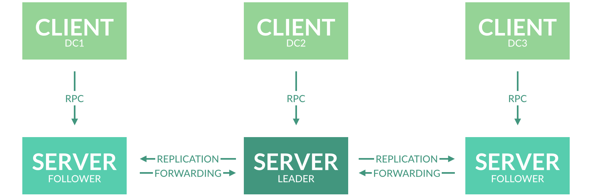
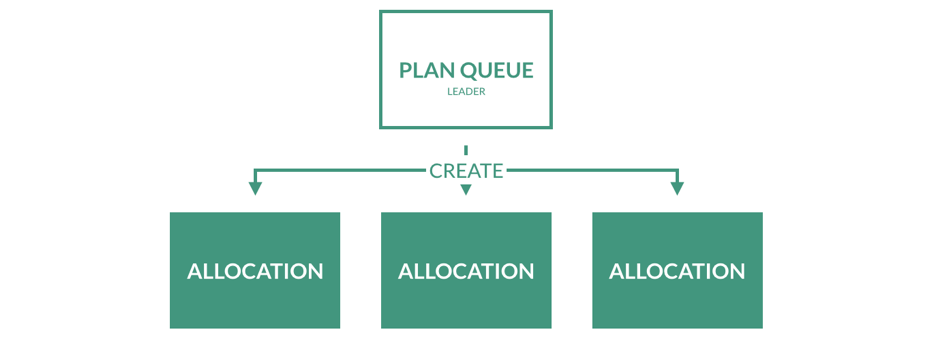
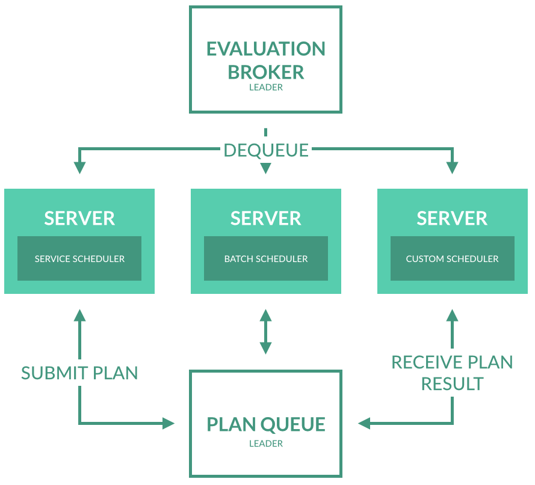

<!-- .slide: data-background="#6C1D5F" -->
<center><div style="width: 75%; height: auto;"></div></center>
<br />
<center>
<table>
  <tr>
    <td>**Bastiaan Bakker**</td><td>*[bbakker@xebia.com](mailto:bbakker@xebia.com)*</td>
  </tr>
  <tr>
    <td>**Mark van Holsteijn**</td><td>*[mvanholsteijn@xebia.com](mailto:mvanholsteijn@xebia.com)*</td>
  </tr>
  <tr>
    <td>**Erik Veld**</td><td>*[eveld@xebia.com](mailto:eveld@xebia.com)*</td>
  </tr>
</table>
</center>

!SLIDE
<!-- .slide: data-background="#6C1D5F" -->
<center></center>

!SLIDE
Nomad is a tool for **managing a cluster of machines and running applications on them**. Nomad **abstracts away machines** and the location of applications, and instead **enables users to declare what they want to run** and Nomad handles where they should run and how to run them.

!SUB
# Architecture


!SUB
# Phase 1: Evaluation


!SUB
# Phase 2: Planning


!SUB
# Phase 3: Allocation


!SUB
- **Job, Task & Taskgroup**: A Job is a specification of tasks that Nomad should run. It consists of Taskgroups, which themselves contain one ore more Tasks.
- **Allocation**: An Allocation is a placement of a Task on a node.
- **Evaluation**: Evaluations are the mechanism by which Nomad makes scheduling decisions.
- **Node, Agent, Server & Client**: A Client of Nomad and a Node are a machine that tasks can be run on. Nomad servers are the brains of the cluster. An Agent can be run in either Client or Server mode.
- **Task Driver**: A Driver represents the basic means of executing your Tasks.

!SUB
# Job types
- **Service**: The service scheduler is designed for scheduling long lived services that should never go down.
- **Batch**: Batch jobs are much less sensitive to short term performance fluctuations and are short lived, finishing in a few minutes to a few days. They can be scheduled and recurring.
- **System**: The system scheduler is used to register jobs that should be run on all clients that meet the job's constraints.

doc: [/docs/jobspec/schedulers.html](https://www.nomadproject.io/docs/jobspec/schedulers.html)

!SUB
# Task drivers
- **Docker**: Run a Docker container
- **Rkt**: Run a Rkt container
- **Exec**: Execute a command for a task using the underlying isolation primitives of the operating system to limit the tasks access to resources
- **Rawexec**: Execute a command for a task without any isolation
- **Java**: Run a downloaded Java jar file
- **Qemu**: Start a Virtual Machine

doc: [/docs/drivers/index.html](https://www.nomadproject.io/docs/drivers/index.html)

!SLIDE
<!-- .slide: data-background="#6C1D5F" -->
# Jobs

!SUB
# Creating
Nomad can initialize an example job for us which we can then modify to our own requirements:

```
$ nomad init
Example job file written to example.nomad

$ cat example.nomad
# There can only be a single job definition per file.
# Create a job with ID and Name 'example'
job "example" {
    # Run the job in the global region, which is the default.
    # region = "global"
...
```

doc: [/docs/jobspec/index.html](https://www.nomadproject.io/docs/jobspec/index.html)

!SUB
```
job "helloworld-v1" {
  datacenters = ["dc1"]
  type = "service"

  update {
    stagger = "30s"
    max_parallel = 1
  }

  group "hello-group" {
    count = 1
    task "hello-task" {
      driver = "docker"
      config {
        image = "eveld/helloworld:1.0.0"
        port_map { http = 8080 }
      }
      resources {
        cpu = 100
        memory = 200
        network { port "http" {} }
...
```
jobs/helloworld-v1.nomad

!SUB
# Launching
Use the run command of the Nomad CLI:
```
$ export NOMAD_ADDR=http://nomad-01.stack.gce.nauts.io:4646
$ nomad run helloworld-v1.nomad
==> Monitoring evaluation "3d823c52-929a-fa8b-c50d-1ac4d00cf6b7"
    Evaluation triggered by job "hellloworld-v1"
    Allocation "f67a-72a4-5a13" created: node "5b7c-a959-dfd9", group "hello-group"
    Evaluation status changed: "pending" -> "complete"
==> Evaluation "3d823c52-929a-fa8b-c50d-1ac4d00cf6b7" finished with status "complete"
```

<br />
You can also submit a job in JSON format to the HTTP API endpoint:
```
$ curl -X POST -d @helloworld-v1.json $NOMAD_ADDR/v1/jobs
```
doc: [/docs/http/index.html](https://www.nomadproject.io/docs/http/index.html)

!SUB
# Where is our job?
```
$ curl -s $NOMAD_ADDR/v1/job/helloworld/allocations | jq .
{
  ...
}
```

Search for the allocations where **.TaskStates.helloworld.State** is not "dead" and collect their **.ID**'s. For each of those .ID's:
```
$ curl -s $NOMAD_ADDR/v1/allocation/<ID> | jq .
{
  ...
}
```
Inside the **.TaskResources.helloworld** block, for each of the **.Networks**, collect the **.IP** and for each of the **.DynamicPorts**, their **.Value**.
Those are the ip's and corresponding ports for your service.

!SUB
Or you can use some JQ-fu and get it with a script:

```
#!/bin/bash
JOB=$1
TASK=$2

# This obviously only works if there is just one port exposed per task.
for ALLOC in $(curl -s "$NOMAD_ADDR/v1/job/$JOB/allocations" \
  | jq -r '.[] \
  | select(.TaskStates.'"$TASK"'.State != "dead") \
  | .ID');
do
  curl -s "$NOMAD_ADDR/v1/allocation/$ALLOC" \
    | jq -r '.TaskResources.'"$TASK"' \
    | .Networks[0].IP + ":" + (.Networks[0].DynamicPorts[0].Value | tostring)'
done

$ ./get_job_address.sh helloworld-v1 hello-task
10.20.30.8:42957
```

!SUB
Check that the job is running properly by calling it:
```
$ curl http://10.20.30.8:42957
Hello v1!
```

!SUB
# Constraints
By specifying constraints you can dictate a set of rules that Nomad will follow when placing your jobs. These constraints can be on **resources**, self applied **metadata** and other configured **attributes**.

```
constraint {
  attribute = "$node.datacenter"
  value = "dc1"
}
```
doc: [/docs/jobspec/index.html](https://www.nomadproject.io/docs/jobspec/index.html)

<br />
- *What happens if you target a constraint that can't be met?*

!SUB
# Restarting
Very few tasks are immune to failure and the addition of **restart policies** recognizes that and allows users to rely on Nomad to keep the task running through transient failures.

```
restart {
  interval = "1m"
  attempts = 2
  delay = "15s"
  on_success = true
  mode = "delay"
}
```
doc: [/docs/jobspec/index.html](https://www.nomadproject.io/docs/jobspec/index.html)

!SUB
# Scaling
Nomad can handle the scaling of your application for you, all you have to do is provide the **desired amount** of instances you want to be running.
This can only be applied on the **taskgroup** level.

```
count = 5
```
doc: [/docs/jobspec/index.html](https://www.nomadproject.io/docs/jobspec/index.html)

<br />
- *What happens if you make the count larger than the number of machines?*

!SUB
# Updating
Nomad allows us to easily do **rolling updates**. Add the **update block** and change the **version** of our job, to do a rolling update.

```
job "helloworld-v2" {
  datacenters = ["dc1"]
  type = "service"

  update {
    stagger = "30s"
    max_parallel = 1
  }

  group "hello-group" {
    count = 5
    task "hello-task" {
      driver = "docker"
      config {
        image = "eveld/helloworld:2.0.0"
...
```
doc: [/docs/jobspec/index.html](https://www.nomadproject.io/docs/jobspec/index.html)

!SLIDE
<!-- .slide: data-background="#6C1D5F" -->
# Service discovery

!SUB
- Uses Consul to expose services and works **without bootstrapping**
- Defined **inside the job description**
- **No external tools** such as Registrator needed

```
service {
  name = "${TASKGROUP}-helloworld-v1"
  tags = ["hello", "v1"]
  port = "http"
  check {
    type = "http"
    interval = "10s"
    timeout = "2s"
    path = "/"
  }
}
```
doc: [/docs/jobspec/servicediscovery.html](https://www.nomadproject.io/docs/jobspec/servicediscovery.html)

!SLIDE
<!-- .slide: data-background="#6C1D5F" -->
# Resource management

!SUB
In order to schedule jobs on the right nodes, Nomad needs to know **which resources**
are available and **where**, and which resources a job needs. Nomad currently can manage the following resources:
- CPU cycles
- memory
- Disk space
- Disk IO
- Network ports
- Network IO

!SUB
# Available Resources
- These are resources Nomad detects at **startup time**
- Since recent versions Nomad **fingerprints periodically**
- Processes not scheduled by Nomad are **not** considered
- Currently it is **not** possible to query unallocated resources

!SUB
The "node" endpoint shows the detected resources:

```
$ curl http://localhost:4646/v1/node/0af1abf0-d55c-3923-188f-495bed729a4e | jq .Resources
{
  "CPU": 2500,
  "MemoryMB": 1704,
  "DiskMB": 7493,
  "IOPS": 0,
  "Networks": [
    {
      "Device": "eth0",
      "CIDR": "10.20.30.5/32",
      "IP": "10.20.30.5",
      "MBits": 1000,
      "ReservedPorts": null,
      "DynamicPorts": null
    }
  ]
}
```

doc: https://www.nomadproject.io/docs/http/node.html

!SUB
# Reserving Resources
Jobs can specify **which** and **how many** resources the need. Nomad the may instruct
the task driver (e.g. Docker) to not let the process use more.

For example the default a job may specify (within the "task" section):

```
resources {
	cpu = 500 # 500 Mhz
	memory = 256 # 256MB
	network {
		mbits = 10
		port "db" {
      static = 3306
		}
	}
}
```

!SLIDE
<!-- .slide: data-background="#6C1D5F" -->
# Things don't always go well in real life

!SUB
# Job failures
- *Are jobs correctly restarted?*

!SUB
# Client failures
Example of a killed node in the docker farm:
```
root@bbakker-nomad-01:~# nomad node-status
ID        Datacenter  Name                  Class   Drain  Status
0b46eda1  dc1         bbakker-farm-01-jmja  docker  false  down
e1191817  dc1         bbakker-farm-02-1q3f  docker  false  ready
9b2e3f82  dc1         bbakker-farm-01-q1ll  docker  false  ready
ecabf2fa  dc1         bbakker-farm-01-6ys5  docker  false  ready
954b5b89  sys1        bbakker-nomad-01      system  false  ready
f99014c9  sys1        bbakker-nomad-02      system  false  ready
45b2d888  sys1        bbakker-nomad-03      system  false  ready
50f3d652  dc1         bbakker-farm-02-42x5  docker  false  ready
```

- *Are jobs correctly transferred to other nodes?*

!SUB
# Master failures
- *Can scheduling still continue?*

!SUB
# Machine failures
- *Can scheduling still continue?*
- *Are jobs correctly transferred to other nodes?*

!SUB
# Decommissioning nodes
We can let Nomad move all of a node's applications by letting it drain:
```
$ nomad node-drain -enable 37b31879
```
We can then view the status of the node with the node-status command:
```
$ nomad node-status
ID        DC    Name                  Class   Drain  Status
37b31879  dc1   bbakker-farm-01-pkdh  docker  true   ready
033744da  dc1   bbakker-farm-01-umft  docker  false  down
b7d2886d  dc1   bbakker-farm-02-2ru3  docker  false  ready
2fae0a91  dc1   bbakker-farm-01-m4s0  docker  false  ready
d8211338  dc1   bbakker-farm-02-17v3  docker  false  ready
ee340c8d  sys1  bbakker-nomad-03      system  false  ready
dfdd7c8e  sys1  bbakker-nomad-01      system  false  ready
0d470098  sys1  bbakker-nomad-02      system  false  ready
```

!SUB
On each machine there is a script that is called on shutdown, which drains a node and waits until all applications are moved.
```
#!/bin/bash
NOMAD_ADDR="http://${1:-localhost}:4646"
NODE_ID=$(curl -s $NOMAD_ADDR/v1/agent/self | jq -r .stats.client.node_id)

echo enable node drain
curl -s -X POST $NOMAD_ADDR/v1/node/$NODE_ID/drain?enable=true > /dev/null

echo wait for drain of all allocations
for t in {0..59} ; do
	ALLOCS=$(curl -s $NOMAD_ADDR/v1/node/$NODE_ID/allocations \
    | jq '[.[] | select(.ClientStatus == "running")] | length')
	echo remaining allocs is $ALLOCS
	if [ "0" == "$ALLOCS" ] ; then
		echo node drain completed
		exit 0
	fi
	sleep 1
done
```

!SUB
# Preemptible instances
Since losing a machine is not critical anymore, we can take advantage of the node-drain feature to use **preemptible instances** at our cloud provider. This will call node-drain **30 seconds** before the node shuts down and **moves all the applications** to healthy nodes.

!SLIDE
<!-- .slide: data-background="#6C1D5F" -->
<center></center>
Want to hear **best practices** and the **latest news** about Nomad and other HashiCorp products?

Come to **HashiConf EU the 13th-15th of June**!
